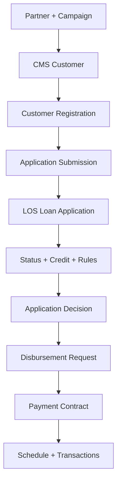

# Thiết kế Data Generation — Smoke Test v1

## 1. Phạm vi

Nguồn chuẩn là bốn Data Dictionary mới nhất:

- `Partner_App_Data_Dictionary(3).xlsx`
- `CMS_Data_Dictionary(1).xlsx`
- `LOS_Data_Dictionary(2).xlsx`
- `Payment_System_Data_Dictionary(1).xlsx`

Generator sinh 14 bảng PostgreSQL. Không sinh hai collection MongoDB `customer_activity` và `notification_log`.

## 2. Dependency

Dữ liệu downstream được sinh từ record upstream đã có; không tự tạo khóa tham chiếu độc lập.

## 3. Scenario-driven generation

Random chỉ dùng để tạo biến thể nhỏ. Business outcome được quyết định theo scenario để chắc chắn các nhánh quan trọng luôn xuất hiện và test tái lập được.

| Scenario | Submission | LOS outcome | Disbursement | Payment |
|---|---|---|---|---|
| CANCELLED | Không tạo | Không tạo | Không | Không |
| SUBMISSION_FAILED | FAILED | Không tạo | Không | Không |
| RECEIVED | SUCCESS | RECEIVED | Không | Không |
| VALIDATING | SUCCESS | VALIDATING | Không | Không |
| ASSESSMENT_FAIL | SUCCESS | REJECTED tại credit | Không | Không |
| RULE_REJECT | SUCCESS | REJECTED bởi rule | Không | Không |
| MANUAL_REVIEW | SUCCESS | MANUAL_REVIEW | Không | Không |
| APPROVED_NO_DISBURSEMENT | SUCCESS | APPROVED | Chưa tạo request | Không |
| DISBURSEMENT_REJECTED | SUCCESS | APPROVED | REJECTED | Không |
| PENDING_DISBURSEMENT | SUCCESS | APPROVED | ACCEPTED | Contract chờ giải ngân |
| ACTIVE_NO_REPAYMENT | SUCCESS | APPROVED | ACCEPTED | ACTIVE, kỳ đến hạn chưa trả |
| ACTIVE_PARTIAL | SUCCESS | APPROVED | ACCEPTED | ACTIVE, trả một phần |
| ACTIVE_PAID | SUCCESS | APPROVED | ACCEPTED | ACTIVE, đã trả các kỳ đến hạn |
| CLOSED | SUCCESS | APPROVED | ACCEPTED | Tất toán đủ |

## 4. Logic chính

### CMS và Partner App

- `citizen_id` resolve về một `customer_id` duy nhất.
- Khách hàng có thể có nhiều registration; lần sau dùng `RELOAN`.
- `NEW_TO_BANK` được tạo CMS ngay trước registration đầu tiên.
- Theo Data Dictionary hiện tại, `campaign_id` là NOT NULL. Campaign `ALWAYS` đại diện cho traffic thông thường, không khuyến mại.
- Registration hủy không có submission; submission lỗi không có hồ sơ LOS.

### LOS

- Current status bằng trạng thái cuối trong `application_status_history`.
- Credit assessment là snapshot một lần trong v1; `declared_income` bằng Partner App.
- DTI = monthly debt obligation / verified income.
- Mỗi hồ sơ tới bước rule sinh ba rule: `MIN_AGE`, `MIN_INCOME`, `MAX_DTI`.
- Khóa logic của rule là `(loan_application_id, rule_code, rule_version)`.
- `APPROVED` chỉ xuất hiện nếu không có mandatory rule mang impact `REJECT` bị FAIL.
- Chỉ `APPROVED` có approved amount, term và interest rate.
- `MANUAL_REVIEW` được hiểu là current routing outcome. Vì bảng decision chỉ cho tối đa một row/application, kết quả cuối sau underwriting phải update row này nếu giữ nguyên schema hiện tại.

### Payment

- Chỉ request `ACCEPTED` mới tạo contract.
- Contract chờ giải ngân chưa có schedule và chưa có disbursement date.
- Sau disbursement SUCCESS, lịch trả nợ dùng dư nợ giảm dần:
  - gốc chia đều;
  - lãi tháng = opening principal × annual rate / 12;
  - kỳ cuối hấp thụ sai số làm tròn phần gốc.
- Chỉ repayment SUCCESS làm giảm `outstanding_principal`.
- Contract `ACTIVE` phải còn dư nợ; `CLOSED` phải dư nợ bằng 0 và mọi kỳ đều PAID.

## 5. Các trạng thái cố ý chưa sinh

Data Dictionary vẫn cho phép `DEFAULTED` và `WAIVED`, nhưng smoke test không sinh hai trạng thái này vì cần thêm rule quá hạn, grace period, collection và miễn giảm. Generator chỉ xác nhận chúng là domain hợp lệ; phase mở rộng mới mô phỏng.

## 6. Kết quả smoke test

- Seed: `20260801`
- As-of date: `2026-07-31`
- Registration: 28, tương ứng 2 record cho mỗi scenario
- 14 file CSV
- 62 nhóm validation: PASS, 0 lỗi
- 2 unit test: PASS
- Chạy hai lần cùng seed cho kết quả giống hệt nhau

Validation bao phủ NOT NULL, domain, PK, unique/composite unique, FK, liên kết xuyên hệ thống, timeline LOS, snapshot credit, rule/decision, disbursement, lịch trả nợ, transaction allocation và outstanding balance.

## 7. Bước mở rộng sau khi smoke test được chấp nhận

1. Chốt phân phối thực tế: tỷ lệ submit lỗi, approve, reject, manual review và delinquency.
2. Tách `scenario allocation` khỏi generator thành config.
3. Tăng volume theo ngày/tháng và sinh batch incremental.
4. Bổ sung late-arriving record, update/CDC và dữ liệu sai có chủ đích trong một dataset test riêng.
5. Nạp CSV vào PostgreSQL rồi kiểm thử constraint ở tầng database.
