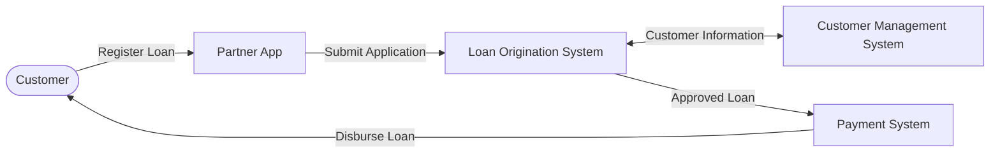
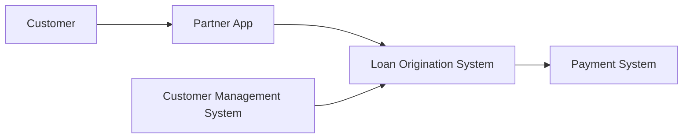
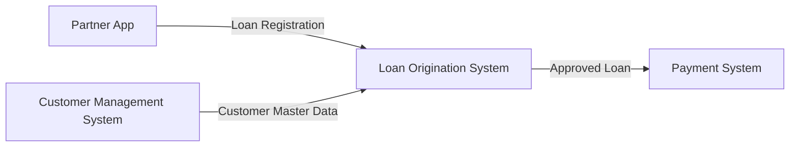

# Version 1.0

# Business Architecture

## Overview

This document describes the business architecture of the Consumer Finance Analytics Platform.

The project simulates a consumer finance company that provides personal loan services through external partner channels. The objective is to reproduce a realistic business environment for building an end-to-end Analytics Engineering platform.

The document defines the operational landscape, business processes, system responsibilities, and business principles that serve as the foundation for the entire data platform.

---

# Business Context

Customers interact with the company through external partner applications such as e-wallets, fintech platforms, or merchant applications.

A loan request passes through multiple operational systems, each responsible for a specific business capability throughout the customer lifecycle.

Rather than operating as a single monolithic application, the platform is organized into independent operational systems that exchange business information while maintaining clear ownership of their respective data.

This architecture reflects how modern consumer finance companies separate customer acquisition, customer management, loan processing, and loan servicing into specialized domains.

---

# Operational Systems Landscape

---

# Operational Systems Overview

| System | Primary Responsibility | Core Business Capability |
|---------|------------------------|--------------------------|
| Partner App | Customer acquisition | Registration, Campaign, Customer Activity |
| Customer Management System (CMS) | Customer master management | Customer Profile, KYC, Employment |
| Loan Origination System (LOS) | Loan lifecycle management | Application, Assessment, Contract |
| Payment System | Loan servicing | Disbursement, Repayment, Payment Processing |

---

# End-to-End Business Process

The customer loan journey consists of five major business stages.

---

## Stage 1 — Customer Registration

Customers browse available loan products through a partner application and submit a loan application.

### Activities

- Browse loan products
- Register for a loan
- Submit loan application
- Capture acquisition information

### Generated Data

- Customer Registration
- Loan Application Submission
- Customer Activity
- Marketing Campaign Information

---

## Stage 2 — Customer Verification

The Loan Origination System retrieves customer master information from the Customer Management System and validates the submitted application.

### Activities

- Retrieve customer profile
- Validate customer information
- Verify application completeness

### Generated Data

- Customer Snapshot
- Validated Application

---

## Stage 3 — Loan Assessment

The Loan Origination System performs credit assessment and evaluates lending policies before making a lending decision.

### Activities

- Assess loan application
- Perform credit assessment
- Evaluate lending rules
- Approve or reject application

### Generated Data

- Application Status
- Approval Result
- Rejection Result

---

## Stage 4 — Contract Generation

For approved applications, the Loan Origination System creates the loan contract and activates the loan account.

### Activities

- Generate loan contract
- Create loan account
- Activate loan

### Generated Data

- Loan Contract
- Loan Information

---

## Stage 5 — Loan Servicing

After loan activation, the Payment System manages all financial transactions throughout the loan lifecycle.

### Activities

- Process loan disbursement
- Generate repayment schedule
- Receive repayments
- Update loan balance

### Generated Data

- Loan Disbursement
- Payment Schedule
- Loan Repayment
- Payment Transaction

---

# Operational Systems

## 1. Partner App

### Purpose

The Partner App is the customer-facing channel responsible for customer acquisition.

It allows customers to discover loan products, submit loan applications, and interact with marketing campaigns while recording digital activity throughout the acquisition journey.

### Responsibilities

- Display loan products
- Receive customer registrations
- Submit loan applications
- Capture customer activity
- Record acquisition channels
- Record campaign information

### Generated Data

#### Operational Data

- Customer Registration
- Loan Application Submission

#### Digital Analytics Data

- Customer Activity
- Campaign Information
- Acquisition Channel

---

## 2. Customer Management System (CMS)

### Purpose

The Customer Management System manages customer master information shared across the organization.

It serves as the single source of truth for customer profile information used by downstream operational systems.

### Responsibilities

- Manage customer profiles
- Maintain customer demographic information
- Maintain customer contact information
- Maintain customer addresses
- Maintain employment information
- Maintain income information
- Maintain KYC information

### Generated Data

- Customer Profile
- Customer Contact Information
- Customer Address
- Customer Employment
- Customer Income
- KYC Information

---

## 3. Loan Origination System (LOS)

### Purpose

The Loan Origination System manages the complete loan application lifecycle from submission through approval and loan creation.

Instead of maintaining customer master information, LOS stores customer snapshots captured during the loan assessment process.

### Responsibilities

- Receive loan applications
- Validate application information
- Manage application workflow
- Track application status
- Request external credit assessment
- Generate loan contracts
- Create loan accounts
- Store customer snapshots
- Record lending decisions

### Generated Data

- Loan Application
- Application Status
- Customer Snapshot
- Loan Contract
- Loan Information
- Approval / Rejection Result

---

## 4. Payment System

### Purpose

The Payment System manages all financial activities after loan approval.

It is responsible for loan disbursement, repayment processing, repayment schedules, and payment history.

### Responsibilities

- Process loan disbursement
- Process customer repayments
- Manage payment transactions
- Maintain repayment schedules
- Maintain repayment history

### Generated Data

- Loan Disbursement
- Loan Repayment
- Payment Schedule
- Payment Transaction

---

# System Relationships

---

# Business Architecture Principles

The business architecture follows several fundamental principles:

- Each operational system owns a single business capability.
- Customer master information is centralized within the Customer Management System.
- Loan processing is isolated within the Loan Origination System.
- Loan servicing is managed independently by the Payment System.
- Customer acquisition is performed exclusively through partner channels.
- Operational systems exchange business information through system integration rather than direct database sharing.
- Customer information is captured as historical snapshots during loan assessment.
- Business entities may exist across multiple operational systems, with each system maintaining its own business perspective and ownership.