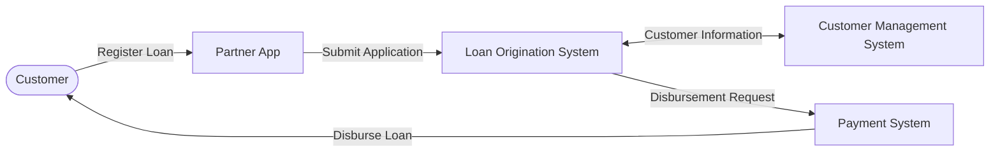

# System Landscape

## Overview

This project simulates the operational systems of a **Consumer Finance Company** that provides loan services through external partner channels.

Customers register loan applications through a **Partner App** (e.g. MoMo). The application is then processed by the company's internal systems, including loan processing, customer management, and payment processing.

The purpose of this project is to simulate these operational systems as data sources for building an end-to-end Data Platform.

---

# System Landscape

---

# System Interaction

The customer interacts with the financial company through the **Partner App**.

Loan applications are submitted to the **Loan Origination System (LOS)**, which coordinates the overall loan process. During processing, LOS retrieves customer information from the **Customer Management System (CMS)** and, once the application is approved, requests the **Payment System** to disburse the loan.

Each operational system owns its own business function and data. Together, they represent the primary source systems for the Data Platform.