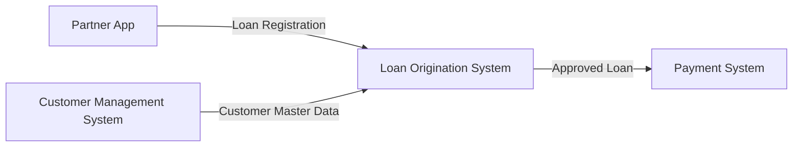

# Version 0.2

# Source Systems

## Overview

The Consumer Finance Analytics Platform ingests data from four operational source systems.

Each system is designed around a specific business capability and owns its operational data. While a business entity may appear across multiple systems, each system maintains its own business perspective and responsibility.

This architecture reflects a modern consumer finance ecosystem where customer acquisition, customer management, loan processing, and payment servicing are separated into independent operational domains.

The separation of business responsibilities enables realistic data integration scenarios while preserving each system as the source of truth for its own business processes.

---

# Source Systems Overview

| Source System | Business Capability | Primary Data |
|---------------|---------------------|--------------|
| Partner App | Customer Acquisition | Registration, Customer Activity, Campaign |
| Customer Management System (CMS) | Customer Master Data | Customer Profile, KYC, Employment |
| Loan Origination System (LOS) | Loan Lifecycle Management | Application, Contract, Loan |
| Payment System | Loan Servicing | Disbursement, Repayment, Payment Transaction |

---

# 1. Partner App

## Purpose

The Partner App is the customer-facing channel where customers discover loan products and submit loan applications through external partners.

Examples include e-wallets, fintech partners, merchant applications, and mobile applications.

The Partner App is responsible for customer acquisition and records both operational business data and digital interaction data.

## Responsibilities

- Display loan products
- Receive customer registrations
- Capture customer interaction activities
- Submit loan applications
- Record marketing campaign information
- Record acquisition channel information

## Generated Data

### Operational Data

- Customer Registration
- Loan Application Submission

### Digital Analytics Data

- Customer Activity
- Campaign Information
- Acquisition Channel

---

# 2. Customer Management System (CMS)

## Purpose

The Customer Management System (CMS) manages customer master data shared across business operations.

CMS serves as the single source of truth for customer master information throughout the organization.

## Responsibilities

- Manage customer profiles
- Maintain customer demographic information
- Maintain customer contact information
- Maintain customer address information
- Maintain customer employment information
- Maintain customer income information
- Maintain KYC information
- Provide customer master data to downstream operational systems

## Generated Data

- Customer Profile
- Customer Contact Information
- Customer Address
- Customer Employment
- Customer Income
- KYC Information

---

# 3. Loan Origination System (LOS)

## Purpose

The Loan Origination System (LOS) manages the complete loan application lifecycle from application submission through approval, contract generation, and loan creation.

LOS focuses on loan processing while consuming customer master data provided by the Customer Management System.

Instead of maintaining customer master information, LOS stores customer snapshots used during loan assessment and approval.

## Responsibilities

- Receive loan applications
- Validate application information
- Manage application workflow
- Track application status
- Request external credit assessment services
- Generate loan contracts
- Create loan accounts
- Store customer information snapshots
- Record final lending decisions

## Generated Data

- Loan Application
- Application Status
- Customer Snapshot
- Loan Contract
- Loan Information
- Approval / Rejection Result

---

# 4. Payment System

## Purpose

The Payment System manages financial transactions throughout the loan lifecycle after loan approval.

It is responsible for servicing active loans by processing disbursements and repayments while maintaining complete payment history.

## Responsibilities

- Process loan disbursement
- Process customer repayments
- Manage payment transactions
- Maintain repayment schedules
- Maintain repayment history

## Generated Data

- Loan Disbursement
- Loan Repayment
- Payment Schedule
- Payment Transaction

---

# Source System Relationships

---

# Design Principles

The source systems follow several architectural principles:

- Each system owns a single business capability.
- Customer master data is centralized within the Customer Management System.
- Loan processing is isolated within the Loan Origination System.
- Financial transactions are managed independently by the Payment System.
- Customer information is captured as snapshots during loan processing to preserve historical business context.
- Operational systems exchange business information through system integration rather than direct database sharing.
- Business entities may exist across multiple systems, with each system maintaining data according to its own business responsibility.