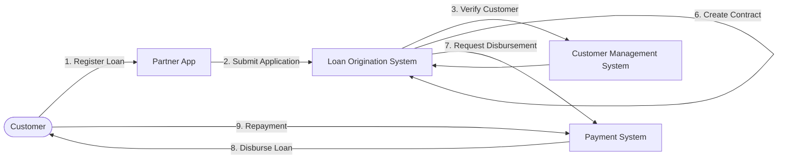

# Business Process

## Overview

This document describes the end-to-end business process of a loan application through a partner channel.

Customers apply for loan products using a Partner App. The application is then processed by the financial company's operational systems until the loan is either approved or rejected. If approved, the loan is disbursed and managed throughout its repayment lifecycle.

---

# Business Process Flow

---

# Business Process

## Step 1 – Loan Registration

The customer accesses the Partner App and selects a loan product.

The customer provides the required information and submits a loan application.

**Output**

- Loan Registration
- Loan Application

---

## Step 2 – Application Submission

The Partner App sends the loan application to the Loan Origination System (LOS).

LOS creates a new application and begins the loan processing workflow.

**Output**

- New Loan Application
- Initial Application Status

---

## Step 3 – Customer Verification

LOS verifies whether the customer already exists in the Customer Management System (CMS).

If the customer already exists, customer information is retrieved.

Otherwise, a new customer profile is created.

**Output**

- Customer Profile
- Customer Verification Result

---

## Step 4 – Application Evaluation

LOS validates the application based on internal business rules.

Examples include:

- Required information
- Customer eligibility
- Basic validation

The application is then evaluated for approval.

**Output**

- Evaluation Result

---

## Step 5 – Loan Decision

LOS determines whether the application is approved or rejected.

If rejected, the application process ends.

If approved, the loan process continues.

**Output**

- Approval Result
- Rejection Result

---

## Step 6 – Contract Creation

For approved applications, LOS creates the loan contract and loan record.

These records become the official representation of the approved loan.

**Output**

- Loan Contract
- Loan

---

## Step 7 – Loan Disbursement

LOS requests the Payment System to disburse the approved loan amount.

The Payment System processes the transaction and transfers the funds to the customer.

**Output**

- Disbursement Transaction

---

## Step 8 – Loan Repayment

After the loan has been disbursed, the customer repays the loan according to the repayment schedule.

Each repayment is processed and recorded by the Payment System.

**Output**

- Repayment Transaction

---

# Business Outcome

At the end of the business process, one of the following outcomes is produced:

- Loan Application Rejected
- Loan Approved
- Loan Contract Created
- Loan Disbursed
- Loan Repayment Recorded

The generated business data serves as the primary input for the Data Platform.
Test 1