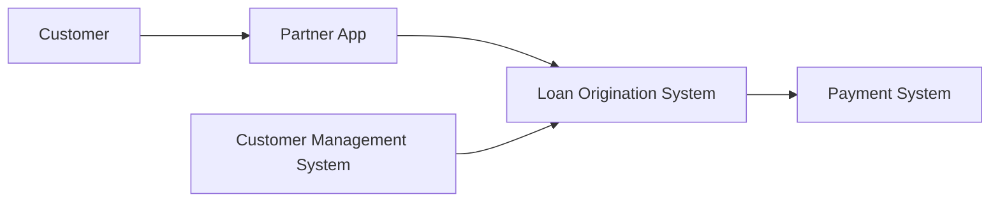

# Version 0.2

# Business Process

## Overview

This document describes the end-to-end loan business process within the Consumer Finance Analytics Platform.

The process begins when a customer applies for a loan through a partner channel and ends when the loan is fully repaid.

Each operational system is responsible for a specific stage of the business process, ensuring clear ownership of business activities and operational data.

---

# End-to-End Business Process



---

# Business Process Stages

## 1. Customer Registration

Customers browse available loan products through a partner application and submit a loan registration request.

At this stage, the Partner App records customer acquisition information and creates the initial loan application request.

### Activities

- Browse loan products
- Register for a loan
- Submit loan application
- Capture acquisition information

### Generated Data

- Customer Registration
- Loan Application Submission
- Customer Activity

---

## 2. Customer Verification

After receiving the loan application, the Loan Origination System retrieves customer master information from the Customer Management System.

The application is validated before entering the credit assessment process.

### Activities

- Retrieve customer profile
- Validate customer information
- Verify application completeness

### Generated Data

- Customer Snapshot
- Validated Application

---

## 3. Loan Assessment

The Loan Origination System performs loan assessment by evaluating customer information and requesting external credit assessment services.

Based on the assessment result, the application is either approved or rejected.

### Activities

- Assess loan application
- Perform credit assessment
- Evaluate lending rules
- Approve or reject application

### Generated Data

- Application Status
- Approval Result
- Rejection Result

---

## 4. Contract Generation

For approved applications, the Loan Origination System generates the loan contract and creates the corresponding loan account.

### Activities

- Generate loan contract
- Create loan account
- Activate loan

### Generated Data

- Loan Contract
- Loan Information

---

## 5. Loan Servicing

After loan activation, the Payment System manages all financial transactions throughout the loan lifecycle.

### Activities

- Process loan disbursement
- Generate repayment schedule
- Receive repayments
- Update loan balance

### Generated Data

- Loan Disbursement
- Payment Schedule
- Loan Repayment
- Payment Transaction

---

# Business Process Summary

```text
Customer

        │

        ▼

Partner App
(Customer Registration)

        │

        ▼

Loan Origination System
(Application Processing)

        │

        ▼

Customer Management System
(Customer Verification)

        │

        ▼

Loan Assessment

        │

        ▼

Loan Contract

        │

        ▼

Payment System
(Loan Servicing)
```

---

# Business Process Principles

The business process follows several principles:

- Customer acquisition is handled by the Partner App.
- Customer master information is managed by the Customer Management System.
- Loan processing is managed by the Loan Origination System.
- Loan servicing is managed by the Payment System.
- Each business activity is owned by a dedicated operational system.