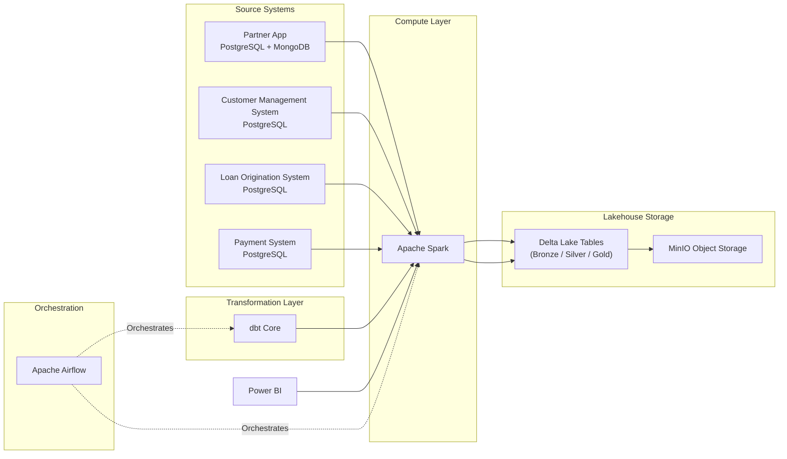

# Version 0.2

# Technical Architecture

## Overview

This document describes the technical architecture of the Consumer Finance Analytics Platform.

The platform adopts a modern Lakehouse architecture that separates operational systems, compute, storage, transformation, orchestration, and analytics into independent layers.

The architecture is designed to simulate a real-world enterprise Analytics Engineering platform using open-source technologies deployed locally with Docker.

---

# Architecture Overview



---

# Technology Stack

| Layer | Technology | Responsibility |
|--------|------------|----------------|
| Source Database | PostgreSQL | Operational transactional data |
| Event Database | MongoDB | Customer activity and event tracking |
| Compute Engine | Apache Spark | Data ingestion and SQL execution |
| Object Storage | MinIO | Physical storage for analytical datasets |
| Table Format | Delta Lake | ACID transactions, metadata management, schema enforcement, and versioning |
| Data Transformation | dbt Core | SQL-based analytical transformations |
| Orchestration | Apache Airflow | Pipeline scheduling and orchestration |
| Analytics | Power BI | Reporting and dashboard visualization |
| Development | Docker Compose | Local deployment and environment management |
| Version Control | Git + GitHub | Source code management |

---

# Architecture Layers

## 1. Source Layer

Operational systems generate transactional business data.

The platform simulates multiple enterprise source systems using relational and document databases.

### Technologies

- PostgreSQL
- MongoDB

---

## 2. Compute Layer

Apache Spark serves as the central compute engine.

It extracts data from operational systems, writes analytical datasets into the Lakehouse, and executes transformation workloads initiated by dbt.

### Responsibilities

- Data ingestion
- Distributed processing
- SQL execution
- Reading and writing Delta tables

### Technology

- Apache Spark

---

## 3. Storage Layer

The platform stores analytical datasets inside an Object Storage system.

MinIO provides an S3-compatible storage layer that simulates enterprise cloud storage services.

### Technology

- MinIO

---

## 4. Lakehouse Layer

Analytical datasets are stored using the Delta Lake table format.

Delta Lake provides ACID transactions, schema evolution, metadata management, and version control over Parquet files stored inside MinIO.

### Logical Layers

- Bronze
- Silver
- Gold

### Technology

- Delta Lake

---

## 5. Transformation Layer

Business transformations are implemented using dbt Core.

dbt sends SQL models to Apache Spark, which executes transformations against Delta Lake tables.

### Responsibilities

- Data cleansing
- Standardization
- Business transformation
- Data modeling
- Data quality validation

### Technology

- dbt Core

---

## 6. Analytics Layer

Business users consume trusted Gold datasets through dashboards and analytical reports.

Power BI connects to the analytical platform for reporting.

### Technology

- Power BI

---

## 7. Orchestration Layer

Apache Airflow coordinates the execution of ingestion, transformation, and reporting workflows.

### Responsibilities

- Pipeline scheduling
- Workflow orchestration
- Dependency management
- Monitoring

### Technology

- Apache Airflow

---

# End-to-End Technical Flow

```text
PostgreSQL / MongoDB

        │

        ▼

Apache Spark
(Compute Engine)

        │

        ▼

Delta Lake Tables
(Bronze → Silver → Gold)

        │

        ▼

MinIO
(Object Storage)

        ▲

        │

Apache Spark SQL
(Executed by dbt Core)

        ▲

        │

dbt Core

        │

        ▼

Power BI


Apache Airflow
Orchestrates Spark and dbt pipelines
```

---

# Design Principles

The technical architecture follows several key principles:

- Separate operational systems from analytical workloads.
- Separate compute from storage.
- Preserve raw operational data before transformation.
- Store analytical datasets using the Delta Lake table format.
- Use object storage compatible with cloud-native architectures.
- Implement SQL-based ELT transformations through dbt Core.
- Orchestrate data pipelines using Apache Airflow.
- Build the platform using open-source technologies suitable for local development.
- Design the platform to be modular, scalable, maintainable, and extensible.