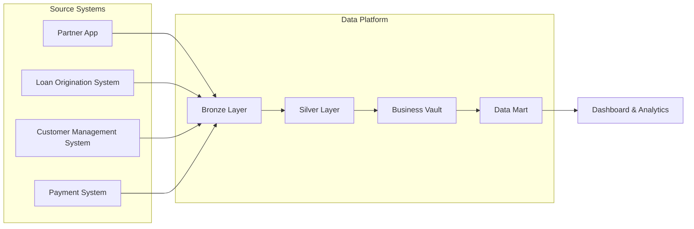

# Data Flow

## Overview

This document describes how data flows through the Consumer Finance Analytics Platform.

The platform collects operational data from multiple source systems, processes it through several logical data layers, and delivers trusted analytical datasets for business reporting and decision-making.

The data flow is designed to ensure data quality, consistency, traceability, and scalability while supporting downstream analytical workloads.

---

# End-to-End Data Flow



---

# Data Flow Stages

The data platform processes data through five logical stages.

Each stage has a dedicated responsibility within the overall architecture.

---

## 1. Source Systems

Operational systems generate business data during daily business activities.

Each system owns its own business domain and is considered the single source of truth for operational data.

### Generated Data

| Source System | Generated Data |
|---------------|----------------|
| Partner App | Customer Activity, Loan Registration |
| Loan Origination System | Loan Application, Contract, Loan |
| Customer Management System | Customer Profile |
| Payment System | Disbursement, Repayment |

---

## 2. Bronze Layer

The Bronze Layer stores raw data extracted from operational systems.

No business transformations are applied at this stage.

The objective is to preserve the original operational data for traceability and auditing.

### Characteristics

- Raw operational data
- Source-oriented
- Immutable where possible
- Historical data retention

---

## 3. Silver Layer

The Silver Layer standardizes and cleans operational data.

Data from different source systems is transformed into consistent structures suitable for downstream processing.

Typical activities include:

- Data cleansing
- Data validation
- Data standardization
- Schema alignment
- Basic enrichment

---

## 4. Business Vault

The Business Vault integrates standardized data into business-oriented models.

At this stage, business entities and relationships are consolidated across multiple operational systems.

Business logic is applied to create trusted enterprise datasets that represent the business consistently.

Examples include:

- Customer
- Loan Application
- Contract
- Loan
- Payment

The Business Vault becomes the primary foundation for analytical modelling.

---

## 5. Data Mart

The Data Mart provides reporting-ready datasets optimized for analytical workloads.

Business data is organized into subject-oriented models that support dashboards, reporting, and self-service analytics.

The Data Mart is designed to provide fast and consistent access to trusted business metrics.

---

# Data Consumers

Business users consume analytical datasets through reporting and visualization tools.

Typical analytical use cases include:

- Loan Performance
- Application Funnel
- Approval Rate
- Customer Analysis
- Repayment Analysis
- Portfolio Monitoring

---

# Data Flow Summary

```text
Operational Systems

        │

        ▼

Bronze Layer
(Raw Data)

        │

        ▼

Silver Layer
(Standardized Data)

        │

        ▼

Business Vault
(Integrated Business Data)

        │

        ▼

Data Mart
(Analytics Models)

        │

        ▼

Dashboard & Analytics
```

---

# Design Principles

The data flow follows several architectural principles:

- Separate operational systems from analytical systems.
- Preserve raw operational data before transformation.
- Apply transformations incrementally across logical layers.
- Integrate business entities before building analytical models.
- Deliver trusted and reusable datasets for reporting and analytics.