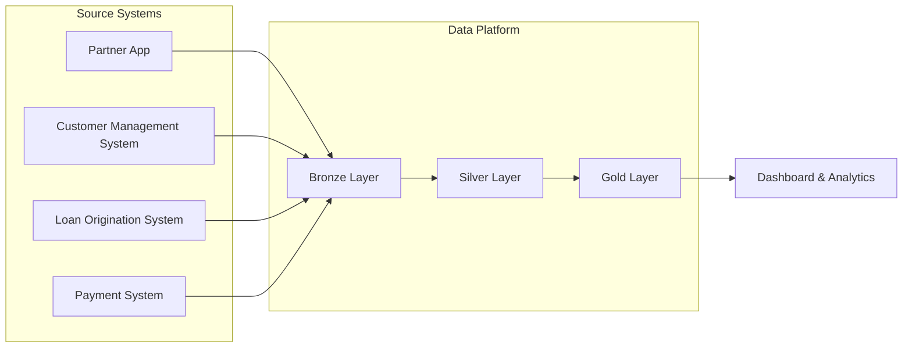

# Version 0.1

# Logical Data Flow

## Overview

This document describes how operational data flows through the Consumer Finance Analytics Platform from source systems to analytical consumption.

The data flow is organized into logical processing layers. Each layer has a specific responsibility for preserving, refining, integrating, and preparing data for business analytics.

The logical architecture separates operational workloads from analytical workloads while ensuring data quality, consistency, and traceability throughout the platform.

---

# End-to-End Data Flow



---

# Data Flow Stages

The platform processes data through four logical layers.

Each layer has a dedicated responsibility within the analytical platform.

---

## 1. Source Systems

Operational systems generate business data through daily business activities.

Each source system owns its operational data and business capability.

### Characteristics

- Operational workloads
- Source-oriented
- Transactional data
- Independent business domains

---

## 2. Bronze Layer

The Bronze Layer stores raw data extracted from operational systems.

The primary objective is to preserve source data with minimal modification.

This layer provides a reliable historical copy of operational data for downstream processing.

### Characteristics

- Raw data
- Source-aligned structure
- Historical retention
- Minimal transformation

---

## 3. Silver Layer

The Silver Layer standardizes and prepares operational data for enterprise-wide use.

Data quality rules are applied and datasets from different source systems are aligned into consistent business entities.

### Typical Activities

- Data cleansing
- Data validation
- Data standardization
- Schema alignment
- Data enrichment
- Business entity integration

---

## 4. Gold Layer

The Gold Layer contains analytics-ready datasets optimized for reporting and business analysis.

Business metrics and analytical models are created to support dashboards and self-service analytics.

### Characteristics

- Business-oriented datasets
- Reporting-ready models
- Optimized for analytical queries
- Trusted business metrics

---

# Data Consumers

Business users consume trusted analytical datasets through reporting and visualization tools.

Typical analytical use cases include:

- Loan Performance
- Application Funnel
- Approval Rate
- Customer Analysis
- Repayment Analysis
- Portfolio Monitoring
- Campaign Performance

---

# Data Flow Summary

```text
Source Systems

        │

        ▼

Bronze Layer
(Raw Data)

        │

        ▼

Silver Layer
(Standardized Data)

        │

        ▼

Gold Layer
(Analytics-ready Data)

        │

        ▼

Dashboard & Analytics
```

---

# Design Principles

The logical data flow follows several architectural principles:

- Separate operational systems from analytical systems.
- Preserve raw operational data before transformation.
- Apply transformations incrementally across logical layers.
- Standardize business entities before analytical modeling.
- Deliver trusted and reusable datasets for business analytics.
- Keep the logical architecture independent from physical implementation technologies.