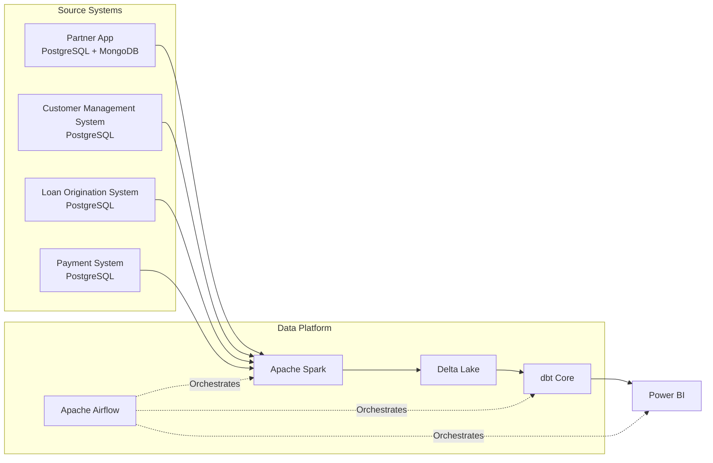

# Version 0.1

# Technical Architecture

## Overview

This document describes the technical architecture of the Consumer Finance Analytics Platform.

The platform adopts a modern Lakehouse architecture to separate operational systems from analytical workloads while supporting scalable data ingestion, transformation, orchestration, and business analytics.

The architecture is designed to simulate a real-world enterprise data platform using open-source technologies that can be deployed locally.

---

# Architecture Overview



---

# Technology Stack

| Layer | Technology | Responsibility |
|--------|------------|----------------|
| Source Database | PostgreSQL | Operational transactional data |
| Event Database | MongoDB | Customer activity and event tracking |
| Data Ingestion | Apache Spark | Extract data from source systems into the Lakehouse |
| Storage | Delta Lake | Store Bronze, Silver, and Gold datasets |
| Data Transformation | dbt Core | Transform data across analytical layers |
| Orchestration | Apache Airflow | Schedule and orchestrate data pipelines |
| Analytics | Power BI | Reporting and dashboard visualization |
| Development | Docker Compose | Local deployment and environment management |
| Version Control | Git + GitHub | Source code management |

---

# Architecture Layers

## 1. Source Layer

Operational systems generate business data during daily operations.

The platform uses relational and document databases to simulate real-world enterprise source systems.

### Technologies

- PostgreSQL
- MongoDB

---

## 2. Ingestion Layer

The ingestion layer extracts data from operational databases and loads it into the analytical platform.

Apache Spark is responsible for ingesting raw operational data while preserving source integrity.

### Technology

- Apache Spark

---

## 3. Storage Layer

The platform adopts a Lakehouse architecture.

All analytical datasets are stored in Delta Lake across multiple logical layers.

### Logical Layers

- Bronze
- Silver
- Gold

### Technology

- Delta Lake

---

## 4. Transformation Layer

Business transformations are implemented using dbt Core.

Data is progressively transformed from raw operational datasets into trusted analytical models.

### Responsibilities

- Data cleansing
- Standardization
- Business transformation
- Data modeling
- Data quality validation

### Technology

- dbt Core

---

## 5. Analytics Layer

Business users consume trusted datasets through interactive dashboards and analytical reports.

### Technology

- Power BI

---

## 6. Orchestration Layer

Pipeline execution is coordinated through workflow orchestration.

Scheduled jobs automate ingestion, transformation, and analytical refresh processes.

### Technology

- Apache Airflow

---

# End-to-End Technical Flow

```text
PostgreSQL / MongoDB

        │

        ▼

Apache Spark

        │

        ▼

Delta Lake

(Bronze → Silver → Gold)

        │

        ▼

dbt Core

        │

        ▼

Power BI

        ▲

        │

Apache Airflow
(Workflow Orchestration)
```

---

# Design Principles

The technical architecture follows several key principles:

- Separate operational systems from analytical workloads.
- Preserve raw source data before applying transformations.
- Adopt a Lakehouse architecture for scalable analytical storage.
- Implement transformations using ELT principles with dbt Core.
- Orchestrate pipeline execution through Apache Airflow.
- Use open-source technologies suitable for local development.
- Design the platform to be modular, maintainable, and extensible.